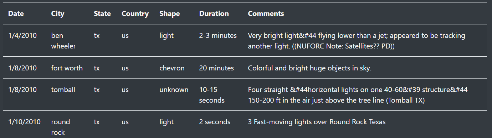

# UFOs
JavaScript and Bootstrap
## Overview
This challenge sought to create a webpage for Dana that captures her written content and comprehensive data collected on UFO sightings. The filterable dataframe included on the site allows viewers to narrow their search/inqueries by date, city, state, country, and/or shape.

## Results
Updating the html file within the challenge altered the way users of the site are able to filter the data. Initially, in the modules, users manually typed the date and has to subsequently click the filter buttom to prompt the site to provide an updated table. In its latest version, the site filters the table automatically after users manually type the value they desire to see presented in the table. The image below depicts the changes and results that would be presented to a user searching for UFO sightings in Texas, U.S. 

## Summary
By having an easily navigable, user-friendly site that allows for a vast array of data on UFO sightings to be reviewed, Dana has opened up numerous opportunities for people to inquire about the peculiar phenomena. However, the site could still be improved by adapting the code further. The most prominent drawback to the page is that  its content margins do not autofit to various browsers. The size of the table does not adjust to its displayed location currently; therfore resolving this issue would be an ideal improvement to the html code. Another potential enhancement to the site would be the inclusion of a map that demonstrates the location of UFO sightings. This would make the data more easily digestible and potentially assist users in narrowing their searches. 
